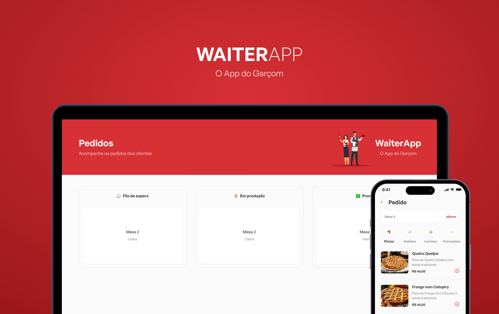

<h1>Waiter App</h1>

  <a href="#-tecnologias">Tecnologias</a>&nbsp;&nbsp;&nbsp;|&nbsp;&nbsp;&nbsp;
  <a href="#-projeto">Projeto</a>&nbsp;&nbsp;&nbsp;|&nbsp;&nbsp;&nbsp;
  <a href="#memo-licença">Licença</a>

  

 

  

## 🚀 Tecnologias

Esse projeto foi desenvolvido com as seguintes tecnologias:

  <image src="https://img.shields.io/badge/Node.js-43853D?style=for-the-badge&logo=node.js&logoColor=white" />
  <image src="https://img.shields.io/badge/MongoDB-4EA94B?style=for-the-badge&logo=mongodb&logoColor=white" />
  <image src="https://img.shields.io/badge/TypeScript-007ACC?style=for-the-badge&logo=typescript&logoColor=white" />
  <image src="https://img.shields.io/badge/React-20232A?style=for-the-badge&logo=react&logoColor=61DAFB" />
  <image src="https://img.shields.io/badge/React_Native-20232A?style=for-the-badge&logo=react&logoColor=61DAFB" />

## 💻 Projeto

O Waiter App é um aplicativo mobile de comanda eletrônica, onde o garçon fará o pedido que chegará no site em tempo real, onde o pessoal poderá mudar o status para: Preparação ou Finalizado.

## :memo: Licença

Esse projeto está sob a licença MIT.

---

Feito com ♥ by [Lucas Silva](https://github.com/lucasilva182) :wave:
